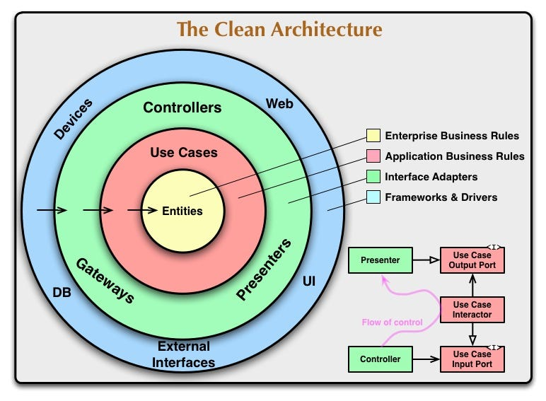

# ¿Qué es esto?

Esto es un pequeño proyecto de arquitectura limpia en 3 capas y este es tan sólo la segunda capa de las tres, esto es la **capa de aplicación**.

[Repositorio de la primera capa, dominio](https://github.com/ProfeJulianLasso/todo-backend-domain)

El ejercicio trata de un simple ToDo con usuario y contraseña. Los nombres que uso aveces pueden parecer extraídos de DDD (Domain-Driven Design).



## Pensamientos

Este paquete por si sólo no funciona, ya que es un compendio de comportamientos, es decir, los casos de uso, los cuales, la futura capa de infraestructura debería de ejecutar para poder mover la solución.

## El repositorio

Trataré al máximo de llevar los commits bajo la filosofía de "[Conventional Commits](https://www.conventionalcommits.org/)", como también de aplicar "[Release Flow](http://releaseflow.org/)".

## ¿Cómo hacerlo caminar?

Inicié trabajando con NPM pero ahora estoy trabajando con PNPM por el tema de velocidad y ahorro de espacio en almacenamiento. Así que los pasos serían los siguientes para probar más que hacerlo caminar ya que este paquete por si solo no debería de funcionar.

**NOTA**: si no sabes qué es PNPM te invito a darle una oportunidad haciendo [clic aquí](https://pnpm.io/).

### Paso 1: Clonar el repositorio

```bash
git clone [FALTA LA URL DEL REPOSITORIO]
```

### Paso 2: Instalación de dependencias

```bash
pnpm install
```

### Paso opcional: Correr los test

```bash
pnpm test
```

O sí desea ver la cobertura entonces sería de la siguiente manera:

```bash
pnpm test:cov
```

### Paso 3: Construcción del paquete

```bash
pnpm build
```

### Paso 4: Crear el enlace simbólico para incluir el paquete en la capa de aplicación

```bash
pnpm link domain --global
```

**NOTA**: recuerde que `domain` es el nombre del proyecto de la capa de dominio. Si usted desea dar otro nombre a la capa de dominio para que no le quede tan genérico, puede modificar el nombre del proyecto en el archivo `package.json` de la capa de dominio, pero no olvide que debe de volver a crear el enlace global y volver nuevamente a la capa de aplicación a volver a realizar el enlace con el nuevo nombre.
